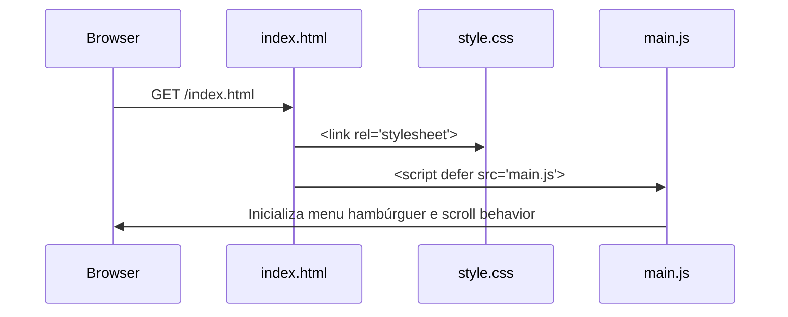

[design.md](https://github.com/user-attachments/files/26544190/design.md)
# Design Técnico — Clínica Sorriso Prime

## Overview

O produto é um site institucional estático de página única (SPA sem framework) para a Clínica Sorriso Prime. O objetivo central é converter visitantes em pacientes via WhatsApp. O site é composto por três arquivos: `index.html`, `style.css` e `main.js`, sem dependência de back-end ou build tools.

A abordagem Mobile-First garante que a experiência em dispositivos móveis seja prioritária, com breakpoints progressivos para tablet (768px) e desktop (1024px). Toda a identidade visual segue a paleta definida nos requisitos: branco, azul claro e verde.

---

## Architecture

O site segue uma arquitetura de arquivos estáticos puros, sem bundler, sem framework JS e sem dependências de runtime:

```
clinica-sorriso-prime/
├── index.html      # Estrutura semântica completa (todas as seções)
├── style.css       # Estilos globais, variáveis CSS, responsividade
└── main.js         # Comportamentos: menu hambúrguer, scroll suave, WhatsApp links
```

### Fluxo de carregamento



### Decisões de arquitetura

- **Sem framework JS**: reduz complexidade e dependências externas; o comportamento necessário (menu, scroll, WhatsApp link) é trivial em vanilla JS.
- **CSS custom properties**: permite manutenção fácil da paleta de cores e tipografia.
- **Google Fonts via `<link>`**: única dependência externa permitida (tipografia).
- **Font Awesome via CDN**: ícones vetoriais sem necessidade de SVG inline manual.
- **Scroll suave via CSS**: `scroll-behavior: smooth` no `html` element, com fallback JS para browsers antigos.

---

## Components and Interfaces

### Componentes HTML (seções)

| Seção | ID âncora | Descrição |
|---|---|---|
| Menu Fixo | `#inicio` | Navbar com logo, links âncora e hambúrguer mobile |
| Hero | `#hero` | Título, subtítulo, CTA WhatsApp, imagem de fundo |
| Sobre | `#sobre` | Texto institucional + 3 cards de destaque (números) |
| Serviços | `#servicos` | Grid de 4 cards (ícone + nome + descrição) |
| Diferenciais | `#diferenciais` | Grid de 4 cards (ícone + título + descrição) |
| Depoimentos | `#depoimentos` | 3 cards de depoimentos com estrelas |
| Equipe | `#equipe` | 3 cards de profissionais (foto circular + nome + especialidade) |
| Contato | `#contato` | CTA WhatsApp + telefone + endereço + iframe Google Maps |
| Rodapé | `footer` | Nome, links rápidos, copyright |
| Botão Flutuante | — | Fixo no canto inferior direito, sempre visível |

### Interface JavaScript (main.js)

```js
// Funções exportadas conceitualmente (módulo único)
initHamburgerMenu()   // toggle do menu mobile
initSmoothScroll()    // fallback scroll suave para links âncora
buildWhatsAppUrl(msg) // retorna URL wa.me com mensagem codificada
```

### WhatsApp URL Pattern

```
https://wa.me/5511999999999?text=Olá%2C%20gostaria%20de%20agendar%20uma%20consulta.
```

O número e a mensagem são definidos como constantes no topo de `main.js`.

---

## Data Models

Por ser um site estático sem back-end, não há modelos de dados persistidos. Os dados são declarados diretamente no HTML como conteúdo estático. As únicas "estruturas de dados" relevantes são as constantes de configuração em `main.js`:

```js
const CONFIG = {
  whatsappNumber: "5511999999999",
  whatsappMessage: "Olá, gostaria de agendar uma consulta na Clínica Sorriso Prime.",
  breakpointMobile: 768,
};
```

### Estrutura de conteúdo por seção (referência)

**Serviço** (repetido 4x no HTML):
```
{ icone: string (classe FA), nome: string, descricao: string }
```

**Diferencial** (repetido 4x):
```
{ icone: string, titulo: string, descricao: string }
```

**Depoimento** (repetido 3x):
```
{ nome: string, texto: string, estrelas: 4 | 5 }
```

**Profissional** (repetido 3x):
```
{ foto: string (placeholder URL), nome: string, especialidade: string }
```

---

## CSS Architecture

### Variáveis CSS (`:root`)

```css
:root {
  --color-white:   #FFFFFF;
  --color-blue:    #4A90D9;
  --color-green:   #2ECC71;
  --color-dark:    #1A1A2E;
  --color-gray:    #F5F5F5;
  --font-main:     'Poppins', sans-serif;
  --section-py:    60px;
  --radius:        8px;
  --shadow:        0 4px 16px rgba(0,0,0,0.08);
}
```

### Breakpoints (Mobile-First)

```css
/* Base: mobile (<768px) */
/* Tablet */
@media (min-width: 768px) { ... }
/* Desktop */
@media (min-width: 1024px) { ... }
```

---


## Correctness Properties

*A property is a characteristic or behavior that should hold true across all valid executions of a system — essentially, a formal statement about what the system should do. Properties serve as the bridge between human-readable specifications and machine-verifiable correctness guarantees.*

### Property 1: Links de WhatsApp são URLs válidas com mensagem

*Para qualquer* elemento âncora no site que represente um CTA de WhatsApp (Hero, Contato, Botão Flutuante), o atributo `href` deve ser uma URL no formato `https://wa.me/{número}?text={mensagem}` onde `{mensagem}` é uma string não vazia após decodificação de URL.

**Validates: Requirements 2.3, 8.1, 9.2**

---

### Property 2: Cards de conteúdo contêm ícone, título e descrição

*Para qualquer* card de serviço ou diferencial renderizado no HTML, o card deve conter: (a) um elemento de ícone (tag `<i>` com classe Font Awesome ou SVG), (b) um elemento de título/nome com texto não vazio, e (c) um elemento de descrição com texto não vazio.

**Validates: Requirements 4.2, 5.2**

---

### Property 3: Seção Depoimentos tem cardinalidade e estrutura corretas

*Para qualquer* renderização da seção Depoimentos, o número de cards de depoimento deve estar entre 2 e 3 (inclusive), e cada card deve conter: nome do paciente (texto não vazio), texto do depoimento (texto não vazio) e elementos de estrela com quantidade entre 4 e 5.

**Validates: Requirements 6.1**

---

### Property 4: Seção Equipe tem cardinalidade e estrutura corretas

*Para qualquer* renderização da seção Equipe, o número de cards de profissional deve estar entre 2 e 3 (inclusive), e cada card deve conter: um elemento `` com atributo `src` não vazio (placeholder), nome completo (texto não vazio) e especialidade (texto não vazio).

**Validates: Requirements 7.1**

---

### Property 5: Seção Sobre exibe ao menos três itens de destaque

*Para qualquer* renderização da seção Sobre, o número de itens de destaque (números/estatísticas) deve ser maior ou igual a 3.

**Validates: Requirements 3.2**

---

### Property 6: Todas as seções têm padding vertical mínimo de 60px

*Para qualquer* seção principal da página (`<section>`), o valor computado de `padding-top` e `padding-bottom` deve ser maior ou igual a 60px conforme definido nas variáveis CSS.

**Validates: Requirements 10.3**

---

### Property 7: Copyright exibe o ano atual

*Para qualquer* momento em que a página é carregada, o texto de copyright no rodapé deve conter o ano corrente (obtido via `new Date().getFullYear()`), garantindo que o ano nunca fique desatualizado.

**Validates: Requirements 11.1**

---

## Error Handling

Por ser um site estático sem back-end, os cenários de erro são limitados a falhas de recursos externos:

| Cenário | Tratamento |
|---|---|
| Google Fonts não carrega | CSS fallback: `font-family: 'Poppins', Arial, sans-serif` |
| Font Awesome CDN indisponível | Ícones ficam invisíveis; layout não quebra (elementos têm dimensão mínima via CSS) |
| iframe Google Maps bloqueado | O iframe exibe mensagem padrão do browser; o restante da seção de contato permanece funcional |
| Imagem placeholder da equipe não carrega | Atributo `alt` descritivo garante acessibilidade; CSS define `background-color` de fallback no elemento `` |
| JavaScript desabilitado | Menu hambúrguer não funciona; scroll suave cai para comportamento padrão do browser; CTAs WhatsApp funcionam normalmente (são links `<a>`) |

---

## Testing Strategy

### Abordagem Dual

O projeto usa dois tipos complementares de teste:

- **Testes de exemplo (unit/DOM)**: verificam conteúdo específico, estrutura do HTML e presença de elementos.
- **Testes de propriedade (property-based)**: verificam invariantes que devem valer para todos os elementos de uma categoria.

### Ferramentas

| Tipo | Biblioteca | Justificativa |
|---|---|---|
| DOM / exemplo | [Jest](https://jestjs.io/) + [jsdom](https://github.com/jsdom/jsdom) | Padrão para testes de DOM em ambiente Node |
| Property-based | [fast-check](https://fast-check.dev/) | Biblioteca PBT madura para JavaScript/TypeScript |

### Testes de Exemplo (Unit)

Focados em verificações concretas e únicas:

- Presença das 7 seções no HTML (`#hero`, `#sobre`, `#servicos`, `#diferenciais`, `#depoimentos`, `#equipe`, `#contato`)
- Menu fixo contém links âncora para todas as seções
- Botão flutuante existe no DOM com `position: fixed`
- Botão flutuante tem dimensões mínimas de 56x56px no CSS
- iframe do Google Maps presente na seção Contato
- Rodapé contém nome da clínica e links de navegação
- Variáveis CSS `--color-blue`, `--color-green`, `--color-white` definidas no `:root`
- Media queries para 768px e 1024px presentes no CSS

### Testes de Propriedade (Property-Based)

Cada propriedade do design é implementada por **um único teste de propriedade** com mínimo de **100 iterações**. Como o HTML é estático, os geradores de fast-check são usados para selecionar subconjuntos aleatórios de elementos e verificar invariantes.

```js
// Exemplo de estrutura de teste de propriedade
// Feature: clinica-sorriso-prime, Property 1: Links de WhatsApp são URLs válidas com mensagem
fc.assert(
  fc.property(fc.constantFrom(...whatsappLinks), (link) => {
    const url = new URL(link.href);
    return url.hostname === 'wa.me' && url.searchParams.get('text')?.length > 0;
  }),
  { numRuns: 100 }
);
```

**Mapeamento propriedade → teste:**

| Propriedade | Tag do teste |
|---|---|
| Property 1 | `Feature: clinica-sorriso-prime, Property 1: Links de WhatsApp são URLs válidas com mensagem` |
| Property 2 | `Feature: clinica-sorriso-prime, Property 2: Cards de conteúdo contêm ícone, título e descrição` |
| Property 3 | `Feature: clinica-sorriso-prime, Property 3: Seção Depoimentos tem cardinalidade e estrutura corretas` |
| Property 4 | `Feature: clinica-sorriso-prime, Property 4: Seção Equipe tem cardinalidade e estrutura corretas` |
| Property 5 | `Feature: clinica-sorriso-prime, Property 5: Seção Sobre exibe ao menos três itens de destaque` |
| Property 6 | `Feature: clinica-sorriso-prime, Property 6: Todas as seções têm padding vertical mínimo de 60px` |
| Property 7 | `Feature: clinica-sorriso-prime, Property 7: Copyright exibe o ano atual` |

### Equilíbrio entre testes

- Testes de exemplo cobrem casos concretos e pontos de integração (estrutura HTML, presença de elementos únicos).
- Testes de propriedade cobrem invariantes universais (todos os links WhatsApp, todos os cards, todas as seções).
- Evitar duplicação: não escrever testes de exemplo para o que já é coberto por propriedades.
